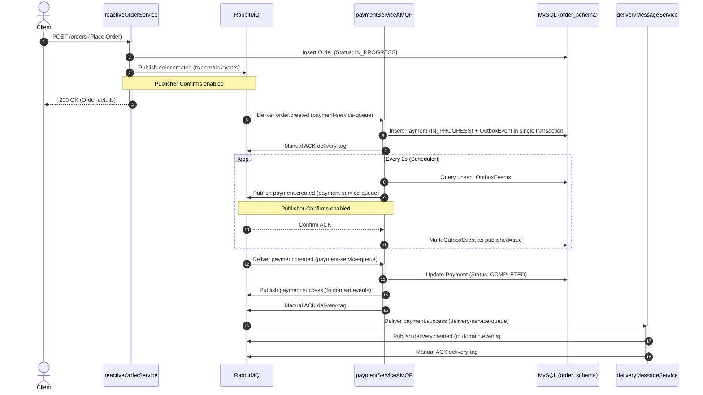

# Event-Driven Microservices with Spring Boot & RabbitMQ

This project is a multi-module Spring Boot application demonstrating event-driven microservices architecture using RabbitMQ as the message broker, R2DBC for reactive database access with MySQL, and the Transactional Outbox pattern.

---

## 📁 Repository Structure

*   [reactiveOrderService/](reactiveOrderService): Reactive order ingestion service using reactor-rabbitmq.
*   [paymentServiceAMQP/](paymentServiceAMQP): Payment processing service utilizing traditional Spring AMQP with manual ACKs, R2DBC transactions, and the Transactional Outbox pattern.
*   [deliveryMessageService/](deliveryMessageService): Lightweight reactive queue listener and publisher acting as a delivery status router.
*   [doc/](doc): Centralized infrastructure configuration files (Docker Compose, RabbitMQ definitions, MySQL init scripts) and architectural guides.
    *   👉 **[RabbitMQ Messaging Concepts Guide](doc/rabbitmq_concepts.md)**: Details queues, exchanges, bindings, routing keys, confirms, and retries.
    *   👉 **[Saga Pattern & Distributed Transactions](doc/saga_pattern.md)**: Compares choreography vs orchestration and maps out our system's Saga flow.
    *   👉 **[The Dual-Write Problem & Solutions](doc/dual_write_solutions.md)**: Details consistency models (ACID vs BASE) and solutions (Outbox, CDC, Saga, 2PC).
    *   👉 **[Transactional Outbox Pattern Comparisons](doc/outbox_pattern_comparison.md)**: Compares polling relays vs CDC, and DBA updates latency patterns.
    *   👉 **[Domain-Driven Design (DDD) Basics](doc/domain_driven_design.md)**: Explains tactical DDD patterns (Entities, Value Objects, Aggregates) and Bounded Contexts.

---

## 📖 Operational Runbook & Verification

This section provides instructions on setting up, running, verifying, and troubleshooting the event-driven microservices.

### 📋 Prerequisites

Before running the services, ensure you have the following installed:
*   **Java Development Kit (JDK) 24**
*   **Apache Maven 3.9+**
*   **Docker & Docker Compose**

### 🚀 Environment Setup

#### 1. Start Infrastructure (RabbitMQ & MySQL)
Launch the containerized infrastructure using Docker Compose. This automatically spins up the RabbitMQ broker and initializes a MySQL instance with the `order_schema` database and all required tables using the [init.sql](doc/rabbitmq/init.sql) script:
```bash
docker-compose -f doc/rabbitmq/docker-compose.yml up -d
```
*   **RabbitMQ Dashboard**: [http://localhost:15672/](http://localhost:15672/) (User: `admin` / Password: `admin`)
*   **MySQL Connection**: Port `3306` (User: `root` / Password: `shamit2020` / Database: `order_schema`)

#### 3. Build & Run Services
Compile the multi-module Maven project from the root:
```bash
mvn clean install
```
Start the microservices by running the Spring Boot application class in separate terminal sessions:

*   **reactiveOrderService** (Port `8080`):
    ```bash
    mvn -pl reactiveOrderService spring-boot:run
    ```
*   **paymentServiceAMQP** (Port `8081`):
    ```bash
    mvn -pl paymentServiceAMQP spring-boot:run
    ```
*   **deliveryMessageService** (Port `8082`):
    ```bash
    mvn -pl deliveryMessageService spring-boot:run
    ```

### 🔍 End-to-End Verification Flows

#### 1. Place an Order (Happy Path)
Send a POST request to place a new order:
```bash
curl -X POST http://localhost:8080/orders \
  -H "Content-Type: application/json" \
  -d '\''{
    "customerId": "cust-998",
    "customerName": "Alice",
    "payment": {
      "amount": 250.00,
      "paymentType": "CARD",
      "cardNo": "1234-5678-9876-5432"
    },
    "delivery": {
      "addressLine1": "123 Main St",
      "city": "Boston",
      "state": "MA",
      "postalCode": "02108"
    }
  }'\''
```

#### 2. Stream Order State Updates
Open a streaming SSE connection to listen for order state changes:
```bash
curl -N http://localhost:8080/orders
```

#### 3. Trigger Manual Outbox Flow
Manually create a payment for a specific order and trigger the outbox event publisher:
```bash
curl -X POST http://localhost:8081/payments/{orderId}
```

### 🛡️ Boundary Validation & Rollback Scenarios

This system enforces strict boundaries to handle partial failures and prevent inconsistent/dirty states:

#### 1. RabbitMQ Publisher Confirm Failures
*   **Failure Source**: The database write commits successfully, but the RabbitMQ broker rejects the message (NACK) or the connection goes down before acknowledgment.
*   **System Action**: In [OrderService.java](reactiveOrderService/src/main/java/com/saha/amit/orderService/service/OrderService.java#L64-L85), the publish confirm is checked. If it is a NACK or throws an error:
    1.  The local database order status is updated from `IN_PROGRESS` to `FAILED`.
    2.  An error is returned to the client.
*   **Verification**:
    1.  Stop the RabbitMQ docker container: `docker container stop rabbitmq`
    2.  Invoke the POST `/orders` endpoint. It will fail with a HTTP 500 error.
    3.  Query the orders database:
        ```sql
        USE order_schema;
        SELECT order_id, order_status FROM orders WHERE customer_id = 'cust-998';
        ```
    4.  Verify that the status of the order is marked as `FAILED`.

#### 2. Outbox Resiliency during Broker Outages
*   **Failure Source**: RabbitMQ is down when a payment is processed.
*   **System Action**: In [PaymentService.java](paymentServiceAMQP/src/main/java/com/saha/amit/orderService/paymentService/service/PaymentService.java#L64-L93), the payment is committed to the database and the outbox event is stored with `published = false`. The HTTP request succeeds, but no event is broadcast.
*   **Verification**:
    1.  Ensure RabbitMQ is running, then stop the `deliveryMessageService`.
    2.  Place an order. Payment is successfully committed.
    3.  Restart the `deliveryMessageService` later. Verify that the outbox publisher automatically delivers the message and updates `published = true` in the `outbox_payment` table once the broker confirms delivery.
    4.  Verify database state consistency:
        ```sql
        SELECT * FROM outbox_payment;
        -- Check that published is updated to 1 (true) after recovery
        ```

#### 3. Manual ACK boundaries (Ack/Nack behavior)
*   **Traditional AMQP listener**: In [RabbitListenerConfig.java](paymentServiceAMQP/src/main/java/com/saha/amit/orderService/paymentService/config/RabbitListenerConfig.java), AcknowledgeMode is configured as `MANUAL`.
*   **Processing behavior**:
    *   In [RabbitMessageListener.java](paymentServiceAMQP/src/main/java/com/saha/amit/orderService/paymentService/messaging/RabbitMessageListener.java), `channel.basicAck` is executed inside `doOnSuccess` only after the payment reactive pipeline successfully terminates.
    *   If the pipeline errors, `channel.basicNack` with `requeue=false` is executed in `doOnError`, pushing the message directly to the dead letter queue (DLQ) (`payment-service-dlq` in Topology 1) to prevent infinite loops.

---

## 🧱 Conceptual Architecture & Design

### System Topology & Event Flow

The system consists of three Spring Boot microservices interacting asynchronously via RabbitMQ. They handle order placement, payment processing, and delivery status routing using MySQL as the persistent store.

### 🔄 Saga Choreography Flow

The distributed transaction spanning these microservices is executed using a Choreography Saga pattern. The step-by-step saga workflow is as follows:

1.  **Order Ingestion**: The client sends a request to [reactiveOrderService](reactiveOrderService), which inserts a new order with `IN_PROGRESS` status and publishes `order.created` to the `domain.events` exchange.
2.  **Payment Setup**: [paymentServiceAMQP](paymentServiceAMQP) consumes the `order.created` event, inserts a payment record in `IN_PROGRESS` status, and logs a corresponding `payment.created` event in the transactional Outbox table in a single local database transaction.
3.  **Outbox Event Publishing**: The scheduler in [paymentServiceAMQP](paymentServiceAMQP) reads the Outbox table every 2s and publishes `payment.created` with publisher confirms. Once ACKed, the event is marked as published.
4.  **Payment Authorization**: [paymentServiceAMQP](paymentServiceAMQP) consumes the `payment.created` event, executes the transaction, saves the payment as `COMPLETED`, and publishes a `payment.success` event.
5.  **Delivery Allocation**: [deliveryMessageService](deliveryMessageService) consumes `payment.success` and publishes a `delivery.created` event simulating order shipping.
6.  **Order Resolution**: The [reactiveOrderService](reactiveOrderService)'s background listener consumes `delivery.completed` (or equivalent success event) and updates the order status to `COMPLETED`.
7.  **Compensating Transactions (Rollback)**: If a step fails downstream (e.g., payment is declined, or delivery cannot be dispatched), compensating events like `payment.failed` or `delivery.failure` are published. Upstream services listen for these failures to execute compensating transactions (e.g., updating the order status to `FAILED`).



---

## ⚙️ Microservices Overview

### 1. `reactiveOrderService`
*   **Purpose**: Manages the order lifecycle. Initiates order ingestion, handles client requests reactively, and exposes an SSE stream of all orders.
*   **Database Interactions**:
    *   `orders` table: Writes order details with status `IN_PROGRESS` on order placement, and reads/updates status to `COMPLETED`/`FAILED` upon receiving downstream events.
*   **RabbitMQ Interactions**:
    *   **Publish**: Emits `order.created` events to exchange `domain.events` with routing key `order.created` (contains full order, payment, and delivery payloads).
    *   **Consume**: Listens to queue `order-service-queue` (bound to routing keys `delivery.success`, `delivery.failure`, and `payment.failure` on exchange `domain.events`).

### 2. `paymentServiceAMQP`
*   **Purpose**: Processes order payments. Implements the Transactional Outbox pattern to guarantee message delivery, and uses manual RabbitMQ acknowledgments for message handling.
*   **Database Interactions**:
    *   `payments` table: Records payment details and updates status from `IN_PROGRESS` to `COMPLETED` during transaction authorization.
    *   `outbox_payment` table: Inserts unpublished outbox events atomically within the local payment transaction, and updates `published = true` once broker ACK is received.
*   **RabbitMQ Interactions**:
    *   **Consume**: Listens to queue `payment-service-queue` (bound to routing keys `order.created`, `payment.created`, and `delivery.failure` on exchange `domain.events`).
    *   **Publish**:
        *   Outbox publisher posts `payment.created` event to exchange `domain.events` with routing key `payment.created` (polled every 2s).
        *   Post-payment handler posts `payment.success` event to exchange `domain.events` with routing key `payment.success`.

### 3. `deliveryMessageService`
*   **Purpose**: Simulates a delivery gateway proxy, acting as an event-forwarding agent that reads from the delivery queue and publishes dispatches.
*   **Database Interactions**:
    *   `delivery` table: Maps the delivery schema (persists delivery status details).
*   **RabbitMQ Interactions**:
    *   **Consume**: Listens to queue `delivery-service-queue` (bound to routing key `payment.success` on exchange `domain.events`).
    *   **Publish**: Emits `delivery.created` event to exchange `domain.events` with routing key `delivery.created` to signify shipment dispatch.

---

## 🔀 RabbitMQ Topologies

The repository includes two distinct RabbitMQ topology setups in the [doc/rabbitmq/](doc/rabbitmq) directory:

| Feature | Topology 1 ([rabbitmq_definitions.json](doc/rabbitmq/rabbitmq_definitions.json)) | Topology 2 ([rabbitmq_definitions2.json](doc/rabbitmq/rabbitmq_definitions2.json)) |
| :--- | :--- | :--- |
| **Exchange Style** | Monolithic Exchange Model | Domain-Specific Exchange Model |
| **Exchanges** | `domain.events` (Topic)<br>`domain.dlx` (Fanout) | `order.exchange` (Topic)<br>`payment.exchange` (Topic)<br>`delivery.exchange` (Topic)<br>Plus separate dead-letter exchanges (`order.dlx`, `payment.dlx`, `delivery.dlx`). |
| **Queues** | `order-service-queue`<br>`payment-service-queue`<br>`delivery-service-queue`<br>`notification-service-queue` | `order-service-queue`<br>`payment-service-queue`<br>`delivery-service-queue` |
| **Retry Strategy** | Messages published straight to Dead-Letter Queues (DLQ) upon NACK. | **Dedicated Retry Queues** (`payment-retry-queue`, `delivery-retry-queue`) with message TTL (5 mins) and Dead-Letter Routing Keys targeting domain exchanges for delayed retries. |

> [!NOTE]
> Topology 1 is loaded by default in [docker-compose.yml](doc/rabbitmq/docker-compose.yml).

### Messaging Routing Matrix (Topology 1)

Messages are routed dynamically through the topic exchange `domain.events` to the individual service queues using specific routing key patterns:

| Message Routing Key | Source Exchange | Target Queue | Subscribing Service |
| :--- | :--- | :--- | :--- |
| `order.created` | `domain.events` | `payment-service-queue` | [paymentServiceAMQP](paymentServiceAMQP) |
| `payment.created` | `domain.events` | `payment-service-queue` | [paymentServiceAMQP](paymentServiceAMQP) |
| `payment.success` | `domain.events` | `delivery-service-queue` | [deliveryMessageService](deliveryMessageService) |
| `delivery.success`<br>`delivery.failure`<br>`payment.failure` | `domain.events` | `order-service-queue` | [reactiveOrderService](reactiveOrderService) |
| `#` *(All Events)* | `domain.events` | `notification-service-queue` | *(Generic notification listener)* |

*   **Topic Exchange**: The `domain.events` exchange matches dot-separated routing keys dynamically.
*   **Wildcard Bindings**: The `notification-service-queue` uses the `#` wildcard binding key, matching zero or more routing key tokens to capture all domain events for auditing/notifications.

---

## 📬 Transactional Outbox Pattern

To guarantee at-least-once message delivery and prevent data consistency issues during database or message broker downtime, the payment service implements a Transactional Outbox pattern.

👉 For complete details on schema design, transactional rollback semantics, and idempotency, see the **[Transactional Outbox Pattern Documentation](paymentServiceAMQP/outbox_pattern.md)**.
