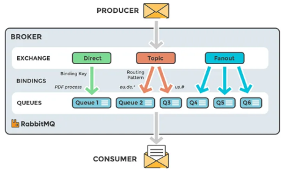
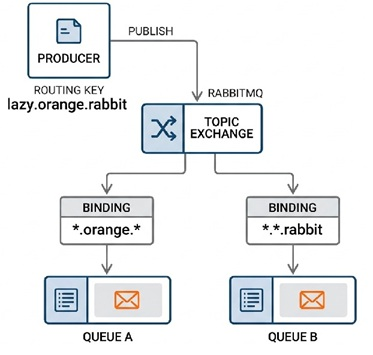
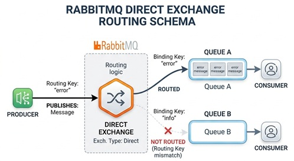
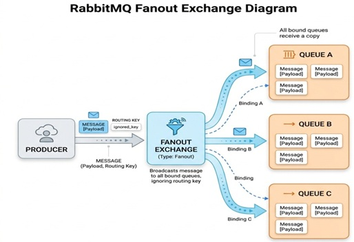

# RabbitMQ Messaging Concepts & Architecture

This guide explains the key architectural concepts of RabbitMQ, how messages are routed, and how reliability and retries are implemented. In RabbitMQ , **messages are sent to exchange, which are then routed to queues based on binding rules, and consumed by services.** 



---

## 🧱 Core Concepts

RabbitMQ is an asynchronous message broker. Instead of services calling each other directly, they communicate by passing messages through the following pipeline:

```
[Producer] ---> [Exchange] --(Routing Key)--> [Queue] ---> [Consumer]
```

*   **Producer**: The application service that creates and sends messages.
*   **Consumer**: The application service that listens to a queue and processes messages.
*   **Exchange**: The message router. It receives messages from producers and determines how to route them to queues based on configuration rules.
*   **Queue**: A buffer that stores messages until they are consumed by a subscribing application.
*   **Binding**: The link/relationship defined between an exchange and a queue. It includes the routing rules.
*   **Routing Key**: An address/label attached to a message by the producer (e.g., `order.created`).
*   **Binding Key**: The pattern defined in the binding that the exchange uses to match against the message's routing key.

---

## 🔀 Exchange Types & Routing Rules

Exchanges route messages differently depending on their type. Here is a comparative matrix of the three primary exchange types:

| Property | Topic Exchange | Direct Exchange | Fanout Exchange |
| :--- | :--- | :--- | :--- |
| **Routing Logic** | Routes based on wildcard pattern matching on dot-separated routing key tokens. | Routes based on an exact matching of the routing key. | Ignores routing keys and broadcasts messages to all bound queues. |
| **Matching Rules** | `*` matches exactly 1 word.<br>`#` matches 0 or more words. | Exact string match (no wildcards). | Broadcast to all (no key matching). |
| **Project Context & Examples** | **Core Routing**: The exchange `domain.events` configured in [rabbitmq_definitions.json](./rabbitmq/rabbitmq_definitions.json) dynamically routes keys like `order.created` or `payment.success` to service queues. | **Example**: If a queue binds to exchange `payment.direct` with key `payment.failed`, only exact matching messages will route there. | **DLX Broadcast**: The dead letter exchange `domain.dlx` configured in [rabbitmq_definitions.json](./rabbitmq/rabbitmq_definitions.json) broadcasts failed messages to all bound DLQ queues. |
| **Visual Flow Diagram** |  |  |  |

### 4. Headers Exchange
*(Note: A 4th, less common type not implemented in this project)*
Routes messages based on key-value pairs in the message headers instead of the routing key. Bindings specify headers to match, and can require matching all (`x-match: all`) or any (`x-match: any`) headers.
*   *Example*: A queue binds to a headers exchange requiring headers `format: pdf` and `type: invoice`. A message with these headers is routed to the queue regardless of the routing key.

---

## 🛡️ Reliability & Delivery Guarantees

### 1. Publisher Confirms
To ensure messages aren't lost between the producer and the broker:
*   The broker sends an **ACK** to the producer once the message is safely stored in a durable queue or routed.
*   If the broker fails to write the message (e.g., disk full), it sends a **NACK**.
*   *Project Reference*: Utilized reactively in [OrderPublisher.java](../reactiveOrderService/src/main/java/com/saha/amit/orderService/messaging/OrderPublisher.java#L42-L52) using `sender.sendWithPublishConfirms()`, and in the blocking client [PaymentPublisher.java](../paymentServiceAMQP/src/main/java/com/saha/amit/orderService/paymentService/messaging/PaymentPublisher.java#L35-L43) by bridging `CorrelationData.getFuture()`.

### 2. Message Acknowledgments (ACK / NACK)
To ensure messages aren't lost between the broker and the consumer:
*   **Auto ACK**: The broker removes the message as soon as it is sent to the network. If the consumer crashes during processing, the message is lost.
*   **Manual ACK**: The consumer sends an explicit `ACK` only after it finishes processing the message. If the consumer crashes before acking, the broker requeues it.
*   *Project Reference*: Confirmed in [RabbitListenerConfig.java](../paymentServiceAMQP/src/main/java/com/saha/amit/orderService/paymentService/config/RabbitListenerConfig.java#L16) where acknowledge mode is set to manual.

---

## 🔄 Resiliency Patterns (Dead Letters & Retries)

### 1. Dead Letter Exchange (DLX)
If a message cannot be processed successfully, it can be routed to a Dead Letter Exchange instead of being dropped:
*   **Trigger Conditions**:
    1.  The message is NACKed by a consumer with `requeue = false` (requeue set to false prevents infinite loops).
    2.  The message expires due to Time-To-Live (TTL).
    3.  The queue length limit is exceeded.
*   *Project Reference*: In [rabbitmq_definitions.json](./rabbitmq/rabbitmq_definitions.json), queues specify `"x-dead-letter-exchange": "domain.dlx"`.

### 2. Retry Queues with Message TTL (Delayed Retries)
Instead of immediate failure, messages can be retried after a delay. This is implemented using queue-level message TTL (Time-To-Live) and a DLX loop:

1.  **Publish to Main Exchange**: Message is routed to the service queue (e.g., `payment-service-queue`).
2.  **Processing Fails**: The service NACKs the message, and it is routed to a dead letter exchange (e.g., `payment.dlx`).
3.  **Forward to Retry Queue**: The DLX routes the message to a **Retry Queue** (e.g., `payment-retry-queue`). This queue has:
    *   No consumers.
    *   A message TTL (e.g., 5 minutes / `300000` ms).
    *   A configured dead letter exchange pointing back to the main exchange (`payment.exchange`) and a dead letter routing key (`payment.created`).
4.  **TTL Expiry**: When the message sits in the retry queue for 5 minutes and expires, RabbitMQ automatically routes it back to the main exchange via its DLX properties, retrying the message.

*   *Project Reference*: This advanced configuration is defined in the alternative topology [rabbitmq_definitions2.json](./rabbitmq/rabbitmq_definitions2.json#L50-L68).

---

## ⚖️ RabbitMQ vs. Apache Kafka (System of Record)

A common architectural question is whether RabbitMQ can act as the "source of truth" (system of record) in the same way Kafka can:

| Architectural Metric | RabbitMQ | Apache Kafka |
| :--- | :--- | :--- |
| **Model** | **Queue-based broker**: Designed for smart routing and transient message delivery. | **Log-based broker**: Designed as a distributed append-only commit log on disk. |
| **Lifecycle** | Messages are deleted immediately upon consumer acknowledgment (ACK). | Messages are retained durably for a specified retention time/size policy. |
| **Replayability** | Natively impossible; once consumed and acked, the message is gone. | Fully supported; consumers track offsets and can replay from any historical point. |
| **Source of Truth** | **No**. The database is always the source of truth; RabbitMQ is strictly the transport channel. | **Yes**. Kafka logs can serve as the event-store/system of record (Event Sourcing). |

---

## 🔀 Exchange Topology Patterns

There are two primary ways to organize exchanges in RabbitMQ:

### 1. Bounded Service Exchanges (Point-to-Point)
Each microservice owns and publishes to its own dedicated exchange (e.g. `order.exchange`, `payment.exchange`). Bindings connect one service's exchange to the next service's queue.
*   *Project Reference*: Configured in [rabbitmq_definitions2.json](./rabbitmq/rabbitmq_definitions2.json).
*   **Pros**: Strong domain boundaries; services have fine-grained control over their exchanges.
*   **Cons**: Tight coupling—the producer service must define bindings pointing to downstream queues, making it harder to add new consumers without modification.

### 2. Monolithic Shared Exchange (Event Bus)
All services publish their events (e.g., `order.created`, `payment.success`) to a single shared exchange (e.g. `domain.events`). Services bind their queues to this exchange using routing key wildcards.
*   *Project Reference*: Configured in [rabbitmq_definitions.json](./rabbitmq/rabbitmq_definitions.json) (loaded by default).
*   **Pros**: Fully decoupled pub/sub; new consumers can bind queues without changing producer logic.
*   **Cons**: Requires strict routing key governance to prevent namespace collisions.

---

## 📋 RabbitMQ Enterprise Best Practices

When building production-ready architectures with RabbitMQ:

1.  **Durable Infrastructure**: Always declare exchanges and queues as `durable = true` and publish messages with persistent delivery mode so they survive broker restarts. Without these flags, both the queue definitions and the messages resting inside them are lost when the broker shuts down or crashes
    -   **Durable Exchange:** The exchange survives broker restarts.
    -   **Durable Queue:** The queue definition survives broker restarts (this alone does _not_ persist the messages).
    -   **Persistent Message:** Messages are saved to disk, ensuring that even if the broker restarts, the data is restored to the durable queue
2.  **Publisher Confirms & Returns**: Enable correlated publisher confirms (`spring.rabbitmq.publisher-confirm-type=correlated`) and returns (`spring.rabbitmq.publisher-returns=true`) to detect broker publish failures and unroutable messages.
3.  **Manual Acknowledgment Mode**: Configure AcknowledgeMode as `MANUAL`. Send basicAck only after the message is processed and saved in the database to guarantee at-least-once processing.
4.  **Listener Concurrency limits**: Tune `spring.rabbitmq.listener.simple.concurrency` and `max-concurrency` to align consumer thread pooling with database connection pool limits (especially with R2DBC).
5.  **DLQ + Backoff Retry Policy**: Do not requeue failed messages immediately (`requeue = false` on NACK). Route them to a DLQ, or route them to a TTL retry queue for exponential backoff retries.
